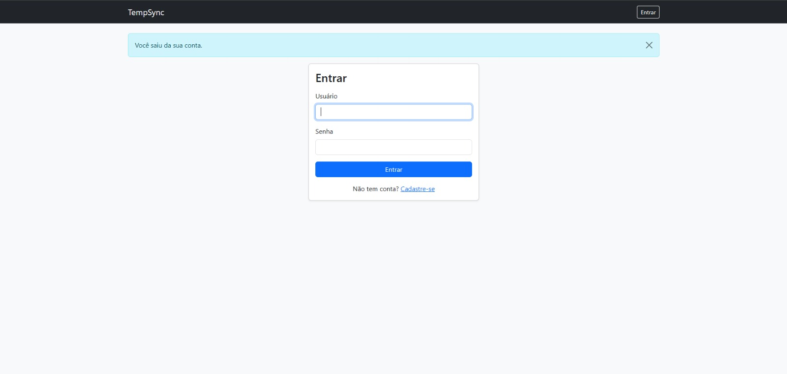
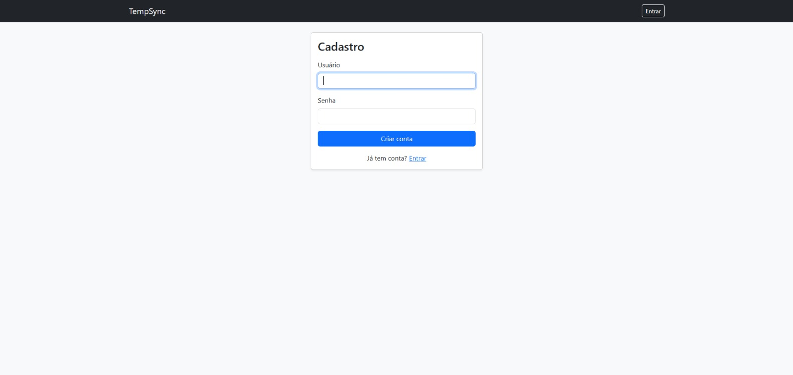
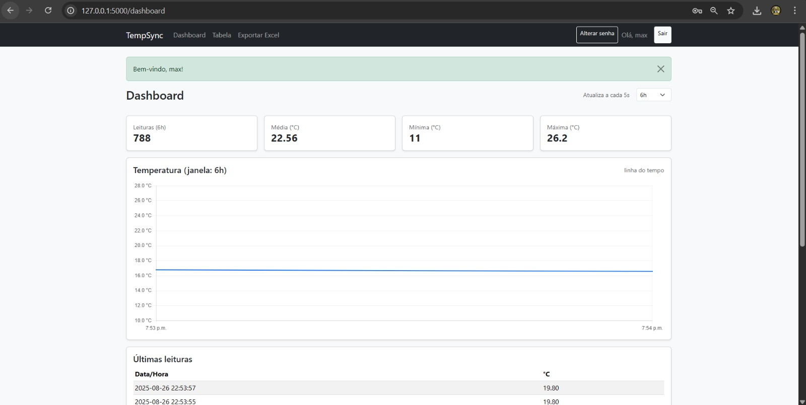
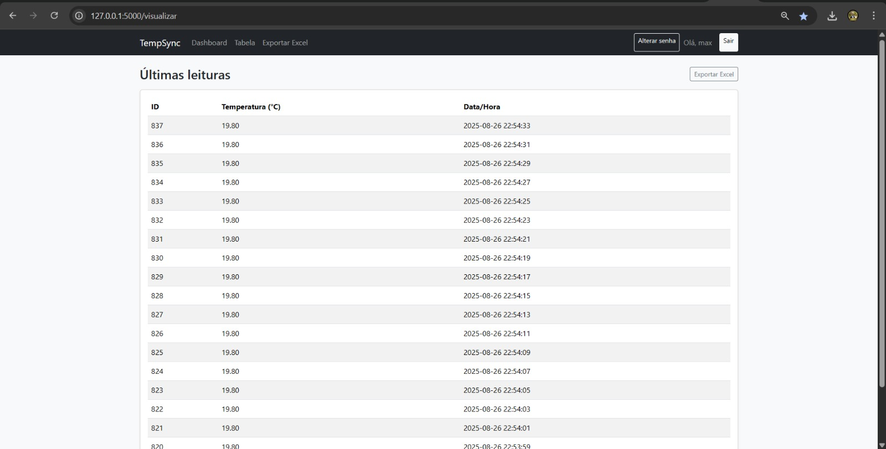
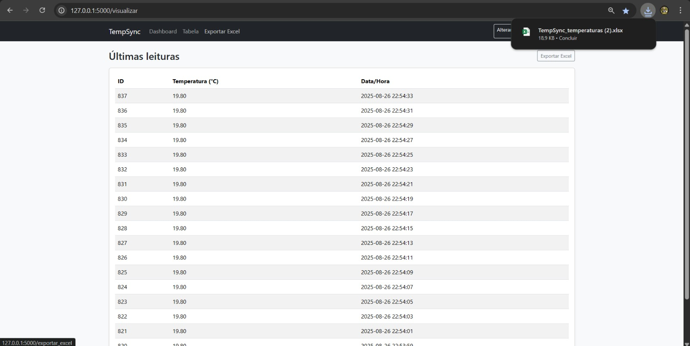
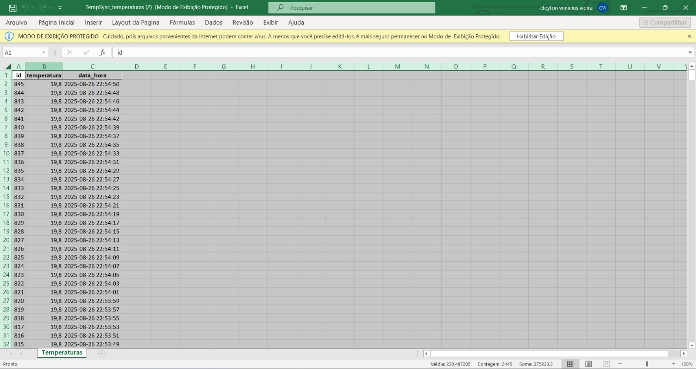
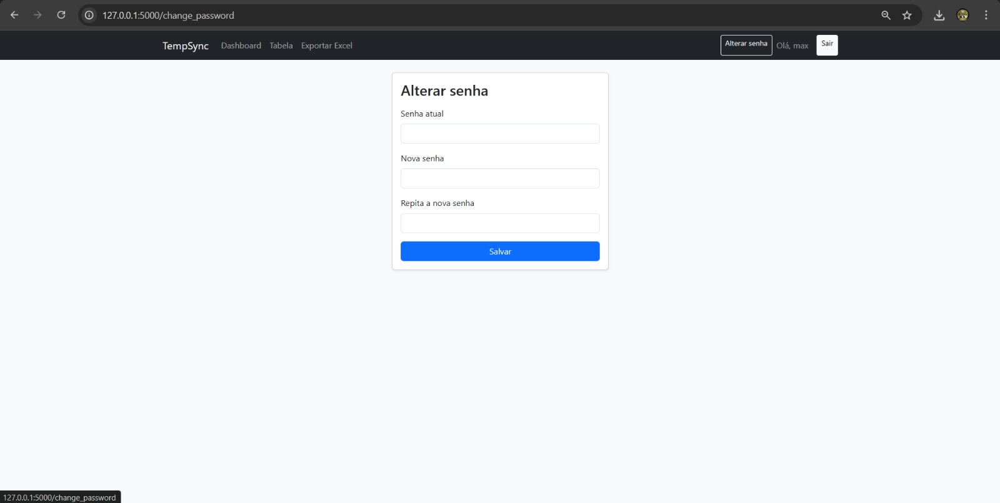

# TempSync — Monitoramento de Temperatura com Arduino + Flask


**TempSync** é um protótipo de **baixo custo** para **monitorar temperatura em tempo real**, integrando **Arduino UNO R3 + DHT11** com uma aplicação **Python/Flask** e banco **SQLite**.  
Os dados são coletados no Arduino, enviados pela **porta serial** e persistidos via API Flask, com **dashboard**, **tabela de leituras** e **exportação para Excel**.

---

## ✨ Funcionalidades
- Coleta de temperatura no **Arduino + DHT11** (intervalo periódico).
- Ingestão de dados via **serial** → `enviar_para_web.py` → **API** (`/temperatura` - POST).
- **Persistência** em **SQLite** com timestamp.
- **Dashboard** com **média / mínima / máxima** e série temporal (janela ajustável).
- **Tabela** de últimas leituras.
- **Exportação Excel** (`.xlsx`) com colunas `id`, `temperatura`, `data_hora`.
- **Autenticação** (cadastro, login, alteração de senha e logout).

## 🖼️ Fluxo em imagens (passo a passo)

As telas abaixo mostram o caminho típico do usuário dentro do TempSync.

**1. Tela de **Login** — informe usuário e senha para acessar o sistema.**




**2. Tela de **Cadastro** — crie uma conta caso ainda não tenha acesso.**




**3. **Dashboard (janela 6h)** — KPIs de leituras, média, mínima e máxima; gráfico temporal e últimas leituras. Atualização automática.**




**4. **Dashboard (janela 7d)** — visão semanal para observar tendência/variações.**


**5. **Tabela** — lista paginada das últimas leituras com ID, temperatura e timestamp.**




**6. **Exportar Excel** — botão gera planilha `.xlsx`; toast confirma o download.**




**7. Planilha **Excel** exportada — colunas `id`, `temperatura`, `data_hora` prontas para análise.**




**8. **Alterar senha** — formulário para trocar a senha do usuário autenticado.**




## 🧱 Arquitetura (alto nível)

```
Arduino (DHT11) ──serial──> leitor_serial.py ──> enviar_para_web.py ──HTTP POST──> Flask (app.py) ──> SQLite
                                                          │
                                                          └──────────> Dashboard / Tabela / Export Excel
```

## 📦 Requisitos
- **Hardware**: Arduino UNO R3, DHT11 (módulo), protoboard, jumpers.
- **Software**: Python 3.10+, pip, Arduino IDE.
- **Bibliotecas Python**: `flask`, `pyserial`, `pandas`, `openpyxl`, `werkzeug`.

> Dica: crie um `requirements.txt` com as libs acima e rode `pip install -r requirements.txt`.

## 🚀 Como rodar

1) **Suba o sketch no Arduino** (DHT11 ligado ao pino digital `2`; VCC=5V; GND=GND).  
   Configure `Serial.begin(...)` e o intervalo de leitura conforme desejar.

2) **Configure o Flask** (`app.py`):  
- Ajuste `SECRET_KEY` e caminho do banco (SQLite).  
- Rotas principais esperadas: `/dashboard`, `/visualizar`, `/exportar_excel`, `/login`, `/register`, `/change_password`, `/temperatura` (POST).

3) **Execute a API (Flask)**:
```bash
python app.py
# acessa em http://127.0.0.1:5000
```

4) **Ingerir dados automaticamente do Arduino** (serial → API):
```bash
python enviar_para_web.py
# configure porta serial (ex.: COM3 ou /dev/ttyUSB0) e baudrate
```

## 🔌 Endpoints úteis
- `POST /temperatura` → recebe: { "temperatura": <float>, "data_hora": "YYYY-MM-DD HH:MM:SS" (opcional) }  
- `GET /visualizar` → lista das últimas leituras (HTML).  
- `GET /dashboard` → visão com KPIs + gráfico.  
- `GET /exportar_excel` → baixa planilha `.xlsx` com as leituras.

> Os nomes podem variar levemente conforme sua versão; ajuste aqui se necessário.

## 🗄️ Estrutura sugerida de pastas
```
.
├── app.py
├── enviar_para_web.py
├── leitor_serial.py
├── temperaturas.db        # SQLite
├── docs/
│   └── screenshots/
│       └── ...png
└── README.md
```

## 🛡️ Segurança & Observações
- Use `SECRET_KEY` forte no Flask e armazene fora do código quando for publicar.
- Autenticação básica implementada (registro, login, alterar senha). 
- Como é uma PoC local, **não exponha** a API sem colocar HTTPS, rate limit e autenticação adicional.
- DHT11 tem **precisão limitada** (≈ ±2 °C). Para produção, considere **DHT22/SHT31** e calibração.

## 🗺️ Roadmap
- Suporte a **múltiplos sensores** e identificação por origem.
- Migração de ingestão para **ESP32** (Wi‑Fi) e **MQTT**.
- Envio de **alertas** (e‑mail/Telegram) por limite de temperatura.
- Migração opcional para **PostgreSQL** ou outra base em nuvem.
- **Docker** para padronizar deploy do backend.

## 👥 Autores
Cleyton Vieira • Lucas de Matos • Maxwell Abreu

## 📜 Licença
Distribuído sob licença **MIT**. Sinta‑se livre para usar e adaptar citando a origem.

---

<sub>README atualizado em 2025-09-30. Atualize os prints/rotas conforme sua versão do código.</sub>
